# 🚍 CollegeBus Tracker
### The Future of Campus Commuting


**CollegeBus Tracker** eliminates the "Last-Mile Uncertainty" for students and admins. Real-time telemetry, 3D visualization, and AI assistance in one PWA.

---

## 🏗️ System Architecture

```mermaid
graph TD
    subgraph "User Ecosystem"
        Driver[👨‍✈️ Driver App]
        Student[🎓 Student/Parent App]
        Admin[🛡️ Admin Dashboard]
    end

    subgraph "Core Engine (React 18)"
        State[📦 Global State Manager]
        GPS[📍 GPS & Sensor Logic]
        Router[🔄 Role-Based Router]
    end

    subgraph "External Services"
        Gemini[🧠 Google Gemini AI]
        MapService[🗺️ MapLibre / OpenFreeMap]
        OSRM[🛣️ OSRM Routing API]
    end

    %% Telemetry Flow
    Driver -->|Device Orientation & Lat/Lng| GPS
    GPS -->|Throttled Updates 50ms| State
    State -->|Broadcast Position| Student
    State -->|Broadcast Position| Admin

    %% AI Flow
    Student -->|Natural Language Query| Gemini
    Student -->|Image Upload - Vision| Gemini
    Gemini -->|Contextual Response| Student

    %% Mapping Flow
    Admin -->|Define Waypoints| OSRM
    OSRM -->|Polyline Geometry| State
    State -->|Render Vectors & 3D Assets| MapService
```



---

## 🚀 Key Features

| Feature | Tech Stack | Description |
| :--- | :--- | :--- |
| **Live Tracking** | `Geolocation API` + `Lerp` | 20fps smooth bus movement with heading synchronization. |
| **AI Assistant** | `Gemini 3.0 Flash` | Context-aware chat for schedules & "Lost & Found" vision analysis. |
| **3D Maps** | `MapLibre` + `Three.js` | Realistic 3D buildings and vehicle models on vector tiles. |
| **Smart Routing** | `OSRM` | Blue-line path generation that snaps strictly to road geometry. |

---

## ⚡ Technical Highlights

### 🧠 **AI-Powered Logic**
*   **Contextual Chat**: Injects last 6 messages for natural conversation.
*   **Computer Vision**: Identifies lost items via camera upload using `gemini-3-flash-preview`.

### 📍 **High-Fidelity Telemetry**
*   **Heading-Up Mode**: Compass-aligned navigation for drivers.
*   **Stateful Engine**: Separates "Actual" (Admin) vs "Broadcast" (Student) coordinates.

### 🎨 **Performance First**
*   **Vendor Splitting**: `manualChunks` for Three.js/MapLibre.
*   **Resilience**: Global error interceptors for spotty networks.

---

## 📂 Structure

```bash
src/
├── components/      # 🧩 Atomic UI (Map, Chat, Admin)
├── services/        # 🔌 Gemini & API Integrations
├── App.tsx          # 🚦 Role-Based Router
└── types.ts         # 📐 Type Definitions
```

---
*Enterprise-Grade Reliability • Spatial Accuracy • AI Logistics*