# 🚍 CollegeBus Tracker
### The Future of Campus Commuting


**CollegeBus Tracker** eliminates the "Last-Mile Uncertainty" for students and admins through real-time telemetry, 3D spatial visualization, and multimodal AI assistance.

---

## 🏗️ System Architecture

```mermaid
graph LR
    %% Definitions
    subgraph Users ["fa:fa-users User Ecosystem"]
        direction TB
        Driver["👨‍✈️ Driver App"]
        Student["🎓 Student App"]
        Admin["🛡️ Admin Panel"]
    end

    subgraph Core ["fa:fa-gears Transit Engine"]
        direction TB
        State["📦 Global State"]
        GPS["📍 Telemetry Logic"]
        Router["🚦 Auth Guard"]
    end

    subgraph AI_Services ["fa:fa-brain AI Intelligence"]
        direction TB
        Gemini["🧠 Gemini 3.0 Flash"]
        Vision["👁️ Vision Analysis"]
    end

    subgraph Mapping ["fa:fa-map Spatial Stack"]
        direction TB
        MapLibre["🗺️ MapLibre GL"]
        OSRM["🛣️ OSRM Routing"]
        ThreeJS["🧊 Three.js (3D)"]
    end

    %% Connections
    Driver ----> GPS
    GPS ----> State
    State ----> Student & Admin
    
    Student -- "Natural Language" --> Gemini
    Student -- "Capture Image" --> Vision
    Vision & Gemini ----> State

    Admin -- "Set Waypoints" --> OSRM
    OSRM -- "Geometry" --> State
    State -- "Render" --> MapLibre & ThreeJS

    %% Styling
    classDef userNode fill:#ecfdf5,stroke:#10b981,stroke-width:2px;
    classDef coreNode fill:#eff6ff,stroke:#3b82f6,stroke-width:2px;
    classDef aiNode fill:#f5f3ff,stroke:#8b5cf6,stroke-width:2px;
    classDef mapNode fill:#fffbeb,stroke:#f59e0b,stroke-width:2px;

    class Driver,Student,Admin userNode;
    class State,GPS,Router coreNode;
    class Gemini,Vision aiNode;
    class MapLibre,OSRM,ThreeJS mapNode;

    style Users fill:#f0fdf4,stroke:#16a34a,stroke-dasharray: 5 5
    style Core fill:#f0f9ff,stroke:#0284c7,stroke-dasharray: 5 5
    style AI_Services fill:#faf5ff,stroke:#7c3aed,stroke-dasharray: 5 5
    style Mapping fill:#fffceb,stroke:#d97706,stroke-dasharray: 5 5
```



---

## 🚀 Key Features

| Feature | Tech | Benefit |
| :--- | :--- | :--- |
| **Live Tracking** | `Geolocation` + `Lerp` | Smooth 20fps bus movement & heading sync. |
| **AI Assistant** | `Gemini 3.0 Flash` | 24/7 support for schedules & lost item detection. |
| **3D Maps** | `MapLibre` + `R3F` | High-fidelity 3D buildings & vehicle visualization. |
| **Smart Pathing** | `OSRM API` | Precise road-snapped routing for accurate ETAs. |

---

## ⚡ Technical Highlights

*   **Multimodal AI**: Vision-based analysis for campus maintenance and lost/found reports.
*   **Driver Compass**: Heading-up mode using device orientation and Three.js interpolation.
*   **Resilient GPS**: Auto-reconnect and signal filtering for high-motion accuracy in transit.
*   **Performance PWA**: Vendor-split bundles for hardware-accelerated mapping and 3D rendering.

---

## 📂 Project Anatomy

```bash
src/
├── components/      # 🧩 3D Models, Maps, AI Chat, Dashboards
├── services/        # 🔌 Gemini SDK & Routing Logic
├── App.tsx          # 🚦 Global State & Security Router
└── types.ts         # 📐 Interface Definitions
```

---
*Enterprise Reliability • Spatial Precision • Intelligent Logistics*