# 🚍 CollegeBus Tracker
### Enterprise-Grade Campus Transit Intelligence & AI-Powered Logistics


**CollegeBus Tracker** is a high-performance, resilient transit ecosystem designed to solve the "last-mile" uncertainty in campus commuting. By synthesizing real-time GPS telemetry, 3D spatial rendering, and Google Gemini's multimodal AI, it provides a mission-critical platform for students, drivers, and administrators.

---

## 🧩 System Architecture & Data Flow

The application operates on a client-centric architecture with real-time state synchronization. Below is the high-level data flow illustrating how telemetry, AI, and mapping services interact.

```mermaid
graph TD
    subgraph "User Ecosystem"
        Driver[👨‍✈️ Driver App]
        Student[🎓 Student/Parent App]
        Admin[🛡️ Admin Dashboard]
    end

    subgraph "Core Engine (React 18)"
        State[📦 Global State Manager]
        GPS[📍 GPS & Sensor Logic]
        Router[🔄 Role-Based Router]
    end

    subgraph "External Services"
        Gemini[🧠 Google Gemini AI]
        MapService[🗺️ MapLibre / OpenFreeMap]
        OSRM[🛣️ OSRM Routing API]
    end

    %% Telemetry Flow
    Driver -->|Device Orientation & Lat/Lng| GPS
    GPS -->|Throttled Updates 50ms| State
    State -->|Broadcast Position| Student
    State -->|Broadcast Position| Admin

    %% AI Flow
    Student -->|Natural Language Query| Gemini
    Student -->|Image Upload - Vision| Gemini
    Gemini -->|Contextual Response| Student

    %% Mapping Flow
    Admin -->|Define Waypoints| OSRM
    OSRM -->|Polyline Geometry| State
    State -->|Render Vectors & 3D Assets| MapService
```



### ⚙️ Core Data Pipelines

1.  **Telemetry Pipeline**:
    *   **Ingestion**: The `DriverDashboard` captures `navigator.geolocation` coordinates and `deviceorientation` (compass heading) data.
    *   **Optimization**: Updates are throttled to ~20fps to balance battery life with visual smoothness.
    *   **Interpolation**: The 3D Bus Model uses Linear Interpolation (Lerp) to smooth out rotation and movement updates, preventing visual "jitter" on the client map.

2.  **AI Pipeline (Gemini 3.0)**:
    *   **Context Injection**: Every chat request automatically injects the last 6 messages of history to maintain conversational context.
    *   **Vision Analysis**: When a user uploads an image (e.g., a lost item or notice board), it is converted to Base64 and sent to the `gemini-3-flash-preview` vision model with a specialized system instruction for data extraction.

3.  **Rendering Pipeline**:
    *   **Layer 1 (Base)**: Vector tiles from OpenFreeMap.
    *   **Layer 2 (3D)**: Building extrusions derived from tile metadata.
    *   **Layer 3 (Route)**: A glowing path line generated by OSRM to snap strictly to road geometry.
    *   **Layer 4 (Assets)**: Interactive React Three Fiber (R3F) canvas overlaid on the map for realistic vehicle representation.

---

## 🎯 The Problem & Our Solution

### The Challenge
Campus transit often suffers from "ghost buses," fragmented communication, and static schedules that don't account for real-time traffic or maintenance issues. Existing solutions are often either too generic or lack the intelligence to assist users with specific transit needs.

### The Innovation
*   **Contextual Awareness**: Unlike static maps, our platform understands the *heading* and *state* of the vehicle using 3D visualization.
*   **Proactive Assistance**: Integrated Gemini AI handles complex logic—from calculating ETAs based on natural language queries to identifying lost items via computer vision.
*   **Unified Command**: A singular codebase serves four distinct user personas with specialized, role-guarded dashboards.

---

## 🛠 Technical Deep Dive

### 1. Spatial Intelligence & Mapping
*   **Vector Engine**: Powered by **MapLibre GL** for hardware-accelerated map rendering.
*   **Dynamic Geometry**: Real-time path calculations using the **OSRM (Open Source Routing Machine)** API, ensuring the blue-line path snaps to actual road networks rather than simple point-to-point lines.
*   **3D Building Extrusions**: Utilizing vector tile metadata to render campus landmarks in 3D for better orientation.

### 2. Multimodal AI Integration (Google Gemini)
*   **Neural Chat**: A context-aware assistant using `gemini-3-flash-preview` to manage transit FAQs and schedule routing.
*   **Computer Vision**: A specialized "Scan & Check" module that uses Gemini's vision capabilities to analyze maintenance reports and "Lost & Found" items directly from the device camera.

### 3. High-Fidelity Telemetry
*   **Heading-Up Navigation**: Drivers benefit from a compass-aligned "Heading-Up" mode, implemented via `deviceorientation` API and lerped (Linear Interpolation) 3D rotations in **Three.js**.
*   **Stateful Tracking**: A custom tracking engine that separates "Actual Location" (for Admins/Safety) from "Broadcast Location" (for Students) to protect driver privacy during off-duty intervals.

---

## ⚡ Performance & Optimization

### Bundle Management
To maintain a "snappy" mobile experience despite heavy 3D and mapping dependencies:
*   **Advanced Code Splitting**: Implemented custom `manualChunks` in Vite to isolate `three.js` and `maplibre-gl` into separate async vendor bundles.
*   **Tree Shaking**: Strict TypeScript implementation ensuring minimal runtime overhead.

### Resilience Engineering
*   **Shadow Windowing**: Custom security layer to prevent clickjacking and frame-injection in cross-origin environments.
*   **Global Error Interception**: A robust listener that suppresses non-critical transient network errors (AbortErrors) common in mobile "spotty" signal areas.
*   **Model Fallbacks**: A procedural 3D bus generator that takes over if the primary GLTF asset fails to load, ensuring the UI remains functional.

---

## 📂 Project Architecture

```text
src/
├── components/          # Atomic UI components (Map, Chat, Admin, Driver)
│   ├── BusModel.tsx     # Three.js / R3F Vehicle logic
│   ├── MapInterface.tsx # MapLibre GL implementation
│   └── ...
├── services/            # Core business logic
│   └── geminiService.ts # Google GenAI SDK integration
├── types.ts             # Strict TypeScript definitions for the ecosystem
├── App.tsx              # Main State Controller & Role-Based Router
└── index.tsx            # Global entry point & Error Interceptors
```

---

## 🎨 Design System
*   **Typography**: Inter (Variable weight) for maximum legibility.
*   **Color Theory**: 
    *   `Slate-900`: Depth and authority for Admin tools.
    *   `Yellow-400`: High-visibility "Safety Yellow" for primary bus indicators.
    *   `Blue-600`: Trust and navigation markers.
*   **UX Pattern**: Bottom-sheet driven interface (Framer Motion) for ergonomic one-handed mobile use.

---
*Developed with a focus on reliability, spatial accuracy, and the future of AI-driven logistics.*