# 🚍 CollegeBus Tracker

### *Stop wondering. Start tracking.*


> **"Are you tired of standing at the bus stop wondering where the bus is?"**
>
> CollegeBus Tracker eliminates "Last-Mile Uncertainty" for students and admins through real-time telemetry, 3D spatial visualization, and multimodal AI assistance.

---

## 🏗️ System Architecture

```mermaid
graph TD
    %% Definitions
    subgraph Clients ["📱 Client Layer (React + Vite)"]
        direction TB
        Driver["👨‍✈️ Driver App"]
        Student["🎓 Student App"]
        Admin["🛡️ Admin Panel"]
        State["📦 Global State Store"]
    end

    subgraph Cloud ["☁️ Cloud Services"]
        direction TB
        MQTT["📡 MQTT Broker (EMQX)"]
        Gemini["🧠 Gemini 3.0 Flash"]
        OSRM["🛣️ OSRM Routing API"]
    end

    subgraph Visualization ["🎨 Rendering Engine"]
        direction TB
        MapLibre["🗺️ MapLibre GL"]
        ThreeJS["🧊 Three.js (3D Bus)"]
    end

    %% Real-time Telemetry Flow
    Driver -- "1. GPS Updates (Pub)" --> MQTT
    MQTT -- "2. Live Coordinates (Sub)" --> State
    State -- "3. Interpolation" --> MapLibre
    MapLibre -- "4. Bearing & Pitch" --> ThreeJS

    %% Admin & Configuration Flow
    Admin -- "5. Update Route/Bus (Pub)" --> MQTT
    MQTT -- "6. Sync Config (Sub)" --> State

    %% AI Assistance Flow
    Student -- "7. Chat / Image Query" --> Gemini
    Gemini -- "8. Contextual Response" --> Student

    %% Routing Flow
    Admin -- "9. Waypoints" --> OSRM
    OSRM -- "10. Polyline Geometry" --> State

    %% Styling
    classDef clientNode fill:#ecfdf5,stroke:#10b981,stroke-width:2px;
    classDef cloudNode fill:#eff6ff,stroke:#3b82f6,stroke-width:2px;
    classDef vizNode fill:#fffbeb,stroke:#f59e0b,stroke-width:2px;

    class Driver,Student,Admin,State clientNode;
    class MQTT,Gemini,OSRM cloudNode;
    class MapLibre,ThreeJS vizNode;

    style Clients fill:#f0fdf4,stroke:#16a34a,stroke-dasharray: 5 5
    style Cloud fill:#f0f9ff,stroke:#0284c7,stroke-dasharray: 5 5
    style Visualization fill:#fffceb,stroke:#d97706,stroke-dasharray: 5 5
```



---

## 🚀 Key Features

| Feature | Tech Stack | Description |
| :--- | :--- | :--- |
| **Live Telemetry** | `MQTT` + `Geolocation` | Sub-second latency updates via WebSocket-based MQTT broker with interpolation. |
| **AI Copilot** | `Gemini 3.0 Flash` | Context-aware chatbot for schedules, routes, and safety inquiries. |
| **Visual Intelligence** | `Gemini Vision` | "Scan & Check" feature to analyze lost items, printed notices, or maintenance issues. |
| **3D Spatial Map** | `MapLibre` + `Three.js` | Immersive map experience with 3D buildings and realistic bus models. |
| **Role-Based Access** | `React Router` | Dedicated interfaces for Students (Tracking), Drivers (Broadcasting), and Admins (Fleet Mgmt). |

---

## 🔐 Demo Access

Explore the platform using these pre-configured accounts:

| Role | Email | Password | Capabilities |
| :--- | :--- | :--- | :--- |
| **Admin** | `admin@gmail.com` | `admin` | Manage routes, buses, drivers, students; View fleet overview. |
| **Driver** | `driver@gmail.com` | `123123` | Broadcast live location; View assigned route; Safety dashboard. |
| **Student** | `student@gmail.com` | `123123` | Track buses; AI Chat; Visual Search; View Schedules. |

---

## 🛠️ Installation & Setup

1. **Clone the repository**
   ```bash
   git clone https://github.com/yourusername/college-bus-tracker.git
   ```

2. **Install dependencies**
   ```bash
   npm install
   ```

3. **Configure Environment**
   Create a `.env` file and add your Gemini API key:
   ```env
   VITE_API_KEY=your_google_genai_api_key
   ```

4. **Run the development server**
   ```bash
   npm run dev
   ```

---

## ⚡ Technical Highlights

*   **Real-time Sync**: Uses MQTT (EMQX) over WebSockets for bidirectional communication between drivers, students, and admins.
*   **Multimodal AI**: Leverages Google's Gemini 3.0 for both text-based assistance and image analysis.
*   **Resilient State**: Custom synchronization logic handles network drops and reconnects automatically.
*   **Performance**: Optimized 3D rendering with procedural generation for bus models to minimize asset loading.

---
*Built with ❤️ for Campus Commuters*